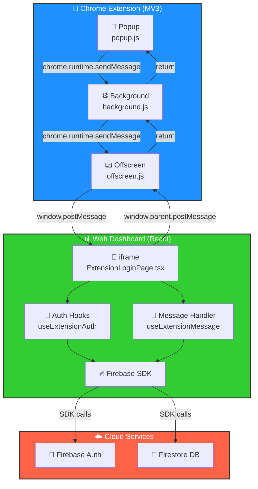
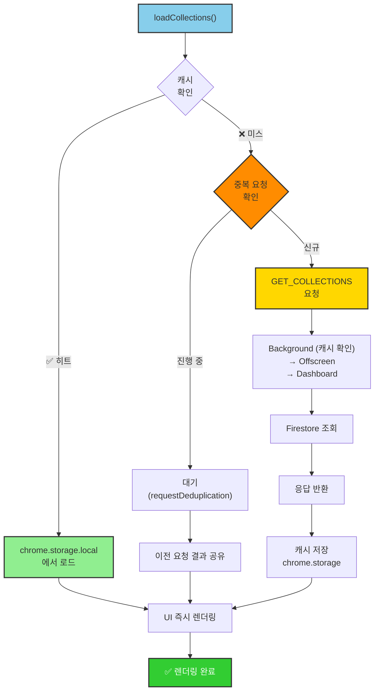
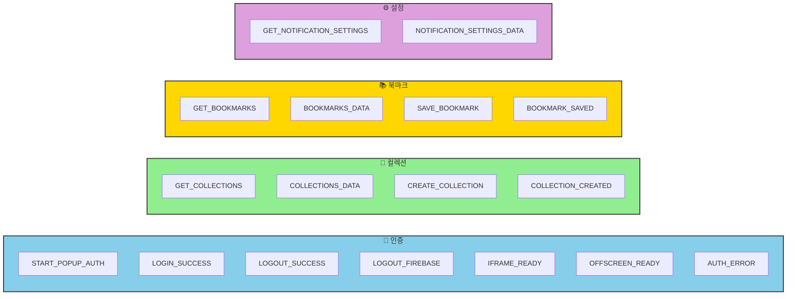
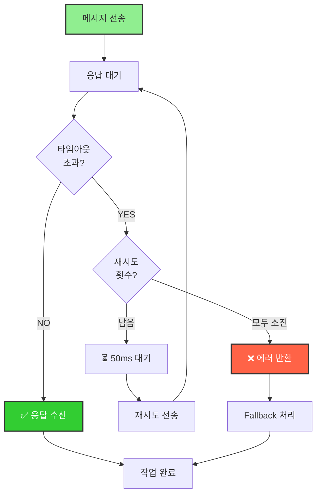

# 📚 북마클 (Bookmarkle)

**통합 북마크 관리 시스템**

북마크를 한 곳에서 관리하고, Chrome Extension과 웹 대시보드를 통해 어디서나 접근하세요.

[](https://firebase.google.com/)
[](https://reactjs.org/)
[](https://www.typescriptlang.org/)
[](https://developer.chrome.com/docs/extensions/mv3/)
[](https://opensource.org/licenses/MIT)

## 📁 프로젝트 구조

```
📚 bookmarkle/
├── 🧩 bookmarkle-browser-extension/  # Chrome Extension (Manifest V3)
│   ├── _locales/                    # 다국어 지원 파일 (i18n)
│   ├── background/                  # Service Worker 모듈
│   ├── firebase/                    # Firebase 설정 및 유틸
│   ├── offscreen/                   # Offscreen Document
│   ├── popup/                       # Extension Popup UI
│   │   ├── popup.html
│   │   ├── scripts/                 # Popup 스크립트
│   │   └── styles/                  # Popup 스타일
│   ├── public/                      # 정적 리소스
│   ├── dist/                        # 빌드 결과물
│   ├── manifest.json                # Extension Configuration
│   ├── content-bridge.js            # Content Script
│   ├── newtab.html/js               # 새 탭 페이지
│   ├── options.html/js              # 설정 페이지
│   └── .env                         # Firebase 환경변수 (⚠️ .gitignore)
│
├── 📊 bookmarkle-web-dashboard/     # React + Vite 웹 대시보드
│   ├── src/
│   │   ├── components/              # UI Components
│   │   ├── hooks/                   # Custom Hooks
│   │   ├── pages/                   # 페이지 컴포넌트
│   │   ├── stores/                  # Zustand 상태 관리
│   │   ├── utils/                   # 유틸리티 함수
│   │   ├── firebase.ts              # Firebase 설정
│   │   └── App.tsx                  # 메인 App
│   ├── dist/                        # Build Output
│   ├── public/                      # 정적 리소스
│   ├── vite.config.ts               # Vite 설정
│   ├── tsconfig.json                # TypeScript 설정
│   ├── tailwind.config.js           # Tailwind CSS 설정
│   ├── firebase.json                # Firebase Hosting 설정
│   └── .env                         # Firebase 환경변수 (⚠️ .gitignore)
│
├── 🛠 빌드 & 배포 스크립트
│   ├── build.sh                     # 통합 빌드 스크립트
│   ├── dev.sh                       # 개발 서버 스크립트
│   ├── deploy.sh                    # 통합 배포 스크립트
│   └── setup-env.sh                 # 환경변수 설정 스크립트
│
├── 📦 build/                        # 빌드 결과물 (⚠️ .gitignore)
│   └── bookmarkle-browser-extension-*.zip # 패키징된 Extension
│
├── 📝 프로젝트 설정
│   ├── .gitignore                   # Git 무시 목록
│   ├── package.json                 # 프로젝트 메타데이터
│   ├── firebase.json                # Firebase Hosting 설정
│   ├── firestore.rules              # Firestore 보안 규칙
│   ├── firestore.indexes.json       # Firestore 인덱스 설정
│   ├── serviceAccountKey.json       # Firebase Admin SDK Key (⚠️ .gitignore)
│   ├── set-admin.js                 # Admin 권한 설정 스크립트
│   └── LICENSE                      # MIT 라이선스
│
└── 📚 README.md                     # 메인 문서
```

## 🆕 최근 업데이트

- **새 컬렉션 추가 옵션 상단 고정** - 드롭다운에서 더 쉽게 접근
- **Firebase 인증 통합** - Extension과 Dashboard 간 완벽한 동기화
- **Background 모듈화** - 유지보수성 향상을 위한 코드 분리
- **Offscreen Document 최적화** - 통신 속도 개선 및 타임아웃 단축
- **컬렉션 실시간 동기화** - Extension ↔ Web 양방향 동기화

## ✨ 주요 기능

### 📚 **북마크 관리**

- **북마크 추가/편집/삭제** - 직관적인 북마크 관리
- **컬렉션 기반 분류** - 카테고리별로 북마크 정리
- **드래그 앤 드롭** - 쉬운 순서 변경 및 분류
- **검색 및 필터링** - 빠른 북마크 찾기
- **아이콘 자동 감지** - 웹사이트 파비콘 자동 수집
- **실시간 동기화** - 모든 기기에서 동일한 북마크

### 🔐 **Firebase Authentication**

- **Google OAuth 로그인** - 간편한 소셜 로그인
- **이메일/패스워드 로그인** - 전통적인 로그인 방식
- **회원가입** - 이메일 기반 계정 생성 및 프로필 설정
- **비밀번호 재설정** - 이메일을 통한 비밀번호 복구
- **자동 세션 관리** - 브라우저 재시작 시에도 로그인 상태 유지
- **실시간 인증 상태** - 로그인/로그아웃 상태 자동 감지

### 🧩 **Chrome Extension (Manifest V3)**

- **원클릭 북마크 추가** - 현재 페이지를 바로 북마크
- **빠른 북마크 접근** - 팝업에서 북마크 검색 및 접근
- **Firebase 실시간 동기화** - Firestore를 통한 데이터 실시간 동기화
- **Offscreen Document** - 확장 프로그램의 DOM 작업 처리

### 📊 **웹 대시보드**

- **반응형 UI** - 모바일, 태블릿, 데스크톱 지원
- **다크/라이트 테마** - 사용자 선호에 맞는 테마
- **위젯 시스템** - 날씨, 명언 등 다양한 위젯
- **자동 백업** - 주기적인 북마크 데이터 백업
- **내보내기/가져오기** - JSON 형태로 데이터 관리

## 📋 사전 요구사항

- **Node.js** 18+
- **npm** 또는 **yarn**
- **Firebase CLI** (`npm install -g firebase-tools`)
- **Chrome Browser** (Extension 개발용)

## 🚀 빠른 시작

### 🔧 초기 설정

#### 1. Firebase 프로젝트 생성

```bash
# Firebase 콘솔에서 새 프로젝트 생성
# https://console.firebase.google.com/

# Authentication 활성화
# - Sign-in method에서 Google 활성화
# - 승인된 도메인에 localhost 추가

# Service Account Key 발급
# - 프로젝트 설정 > 서비스 계정
# - "새 비공개 키 생성" 클릭
# - serviceAccountKey.json 파일 다운로드
# - 프로젝트 루트에 저장
```

#### 2. 환경변수 설정

##### 북마클 웹 대시보드 환경 변수 (`bookmarkle-web-dashboard/.env`)

```bash
VITE_FIREBASE_API_KEY=your_api_key_here
VITE_FIREBASE_AUTH_DOMAIN=your_project.firebaseapp.com
VITE_FIREBASE_PROJECT_ID=your_project_id
VITE_FIREBASE_STORAGE_BUCKET=your_project.appspot.com
VITE_FIREBASE_MESSAGING_SENDER_ID=your_sender_id
VITE_FIREBASE_APP_ID=your_app_id
```

##### Chrome Extension 설정 (`bookmarkle-browser-extension/.env`)

```bash
FIREBASE_API_KEY=your_api_key_here
FIREBASE_AUTH_DOMAIN=your_project.firebaseapp.com
FIREBASE_PROJECT_ID=your_project_id
FIREBASE_STORAGE_BUCKET=your_project.appspot.com
FIREBASE_MESSAGING_SENDER_ID=your_sender_id
FIREBASE_APP_ID=your_app_id
```

**참고**: Extension은 빌드 시 `inject-config.sh` 스크립트가 `.env` 파일의 값을 자동으로 `firebase/config.js`에 주입합니다.

#### 3. Firebase Hosting 사이트 생성

```bash
# 메인 웹앱용 사이트 (기본)
firebase hosting:sites:create YOUR_PROJECT_ID
```

### 📦 전체 프로젝트 관리

```bash
# 모든 프로젝트 빌드
npm run build
./build.sh all

# 모든 프로젝트 배포
npm run deploy
./deploy.sh all

# 모든 프로젝트 개발 서버 실행
npm run dev:all
./dev.sh all
```

### 📱 개별 프로젝트 관리

#### 🌐 북마클 웹 대시보드 (bookmarkle-web-dashboard)

```bash
# 개발 서버 실행
npm run dev:dashboard
./dev.sh dashboard

# 빌드
npm run build:dashboard
./build.sh dashboard

# 배포
npm run deploy:dashboard
./deploy.sh dashboard "배포 메시지"
```

#### 🧩 Chrome Extension (bookmarkle-browser-extension)

```bash
# 빌드 & 패키징
npm run build:extension
./build.sh my-extension

# 배포
npm run deploy:extension
./deploy.sh my-extension "배포 메시지"
```

## 📋 사용 가능한 스크립트

### 🔧 통합 스크립트

| 스크립트      | 설명      | 사용법                            |
| ------------- | --------- | --------------------------------- |
| `./deploy.sh` | 통합 배포 | `./deploy.sh [프로젝트] [메시지]` |
| `./dev.sh`    | 개발 서버 | `./dev.sh`                        |
| `./build.sh`  | 통합 빌드 | `./build.sh [프로젝트]`           |

### 📋 NPM 스크립트

| 명령어                     | 설명                           |
| -------------------------- | ------------------------------ |
| `npm run setup`            | 환경변수 초기 설정             |
| `npm run build`            | 모든 프로젝트 빌드             |
| `npm run build:dashboard`  | 웹 대시보드 빌드               |
| `npm run build:extension`  | Chrome Extension 빌드 & 패키징 |
| `npm run deploy`           | 모든 프로젝트 배포             |
| `npm run deploy:dashboard` | 웹 대시보드 배포               |
| `npm run deploy:extension` | Chrome Extension 배포          |
| `npm run dev`              | 웹 대시보드 개발 서버 (기본)   |
| `npm run dev:all`          | 모든 프로젝트 개발 서버        |
| `npm run dev:dashboard`    | 웹 대시보드 개발 서버          |
| `npm run dev:extension`    | Extension 개발용 빌드          |
| `npm run start`            | 웹 대시보드 개발 서버 (별칭)   |

## 🔧 설정

### 환경변수 자동 설정

```bash
# 환경변수 설정 스크립트 실행
./setup-env.sh

# Firebase 설정 정보 입력 후 자동으로 모든 설정 파일 생성
```

### 수동 설정

각 프로젝트의 Firebase 설정 파일을 수동으로 생성할 수 있습니다:

**웹 대시보드** (`bookmarkle-web-dashboard/.env`):

```bash
VITE_FIREBASE_API_KEY=your_api_key
VITE_FIREBASE_AUTH_DOMAIN=your_project.firebaseapp.com
VITE_FIREBASE_PROJECT_ID=your_project_id
VITE_FIREBASE_STORAGE_BUCKET=your_project.appspot.com
VITE_FIREBASE_MESSAGING_SENDER_ID=your_sender_id
VITE_FIREBASE_APP_ID=your_app_id
```

**Chrome Extension** (`bookmarkle-browser-extension/.env`):

```bash
FIREBASE_API_KEY=your_api_key
FIREBASE_AUTH_DOMAIN=your_project.firebaseapp.com
FIREBASE_PROJECT_ID=your_project_id
FIREBASE_STORAGE_BUCKET=your_project.appspot.com
FIREBASE_MESSAGING_SENDER_ID=your_sender_id
FIREBASE_APP_ID=your_app_id
```

**Service Account Key**: `serviceAccountKey.json` (프로젝트 루트에 저장 - ⚠️ .gitignore)

**참고**: `.env.example` 파일을 복사하여 `.env`로 저장한 후 실제 값을 입력하세요.

## 📚 기술 스택

### 🧩 Chrome Extension

- **언어**: JavaScript/TypeScript
- **아키텍처**: Manifest V3
- **특징**:
  - Service Worker 기반 백그라운드 작업
  - Offscreen Document를 통한 DOM 조작
  - Firebase 실시간 데이터 동기화
  - 다국어 지원 (\_locales)

### 📊 웹 대시보드

- **프레임워크**: React 19 + TypeScript
- **번들러**: Vite
- **상태 관리**: Zustand
- **스타일링**: Tailwind CSS
- **백엔드**: Firebase (Authentication, Firestore)
- **특징**:
  - 반응형 디자인 (Mobile/Tablet/Desktop)
  - Dark/Light 테마
  - 실시간 동기화

### 🔥 백엔드

- **인증**: Firebase Authentication (Google OAuth, Email/Password)
- **데이터베이스**: Firebase Firestore
- **호스팅**: Firebase Hosting
- **Admin SDK**: Node.js 기반 관리 도구

## 📡 통신 구조 (Communication Architecture)

### 🏗️ 전체 아키텍처



### 🔐 로그인 시퀀스 (Authentication Flow)

```mermaid
sequenceDiagram
    participant U as 👤 User
    participant Pop as Popup
    participant BG as Background
    participant Off as Offscreen
    participant Dash as Dashboard
    participant FB as Firebase

    U->>Pop: 1️⃣ 로그인 버튼
    Pop->>U: 2️⃣ Dashboard 새 탭 오픈

    BG->>Off: 3️⃣ ensureOffscreenDocument()
    Off->>BG: 4️⃣ OFFSCREEN_READY
    Note over BG: isOffscreenReady = true (캐싱)

    Dash->>Dash: 5️⃣ 확장 컨텍스트 감지
    Dash->>Off: 6️⃣ IFRAME_READY

    U->>Dash: 7️⃣ Google 로그인
    Dash->>FB: 8️⃣ signInWithPopup()
    FB-->>Dash: 9️⃣ ID Token + User

    Dash->>FB: 🔟 fetchCollections()
    FB-->>Dash: 1️⃣1️⃣ Collections

    Dash->>Off: 1️⃣2️⃣ LOGIN_SUCCESS
    Off->>Off: 1️⃣3️⃣ 저장 (chrome.storage)
    Off->>BG: 1️⃣4️⃣ 완료
    BG->>Pop: 1️⃣5️⃣ 상태 업데이트

    Pop->>Pop: 1️⃣6️⃣ 프로필 렌더링
    Pop-->>U: 1️⃣7️⃣ ✅ 로그인 완료

    Note over Dash,FB: Firebase SDK는 Iframe에서만 실행
    Note over BG,Off: PING 제거로 통신 횟수 감소
```

### 📚 북마크 저장 시퀀스 (Bookmark Saving)

```mermaid
sequenceDiagram
    participant U as 👤 User
    participant Pop as Popup
    participant BG as Background
    participant Off as Offscreen
    participant Dash as Dashboard
    participant FS as Firestore

    U->>Pop: 1️⃣ "북마크 저장" 클릭
    Pop->>Pop: 2️⃣ 페이지 정보 수집

    Pop->>BG: 3️⃣ SAVE_BOOKMARK
    Note over BG: performance.now() 시작
    
    alt isOffscreenReady === true
        BG->>Off: 4️⃣ 즉시 전송 (캐시 히트)
    else
        BG->>Off: 4️⃣ setupOffscreen 후 전송
    end

    Off->>Dash: 5️⃣ saveBookmark 요청
    Dash->>FS: 6️⃣ saveBookmarkDirect()
    FS-->>Dash: 7️⃣ ✅ Saved

    Dash->>Off: 8️⃣ BOOKMARK_SAVED
    Off->>BG: 9️⃣ 응답
    Note over BG: performance.now() 종료<br/>시간 측정 로그
    BG->>Pop: 🔟 최종 응답

    Pop->>Pop: 1️⃣1️⃣ 성공 토스트
    Pop-->>U: 1️⃣2️⃣ ✅ 완료

    Note over Off,Dash: 타임아웃: 10초
    Note over BG,Off: maxRetries: 1 (재시도 최소화)
```

### 📂 컬렉션 조회 (with Cache & Deduplication)



### 📤 메시지 타입 분류



### ⏱️ 타임아웃 전략



**타임아웃 설정** (최적화됨):

| 작업 | 시간 | 재시도 | 비고 |
|------|------|--------|------|
| AUTH 팝업 | 60초 | - | 사용자 입력 대기 |
| 컬렉션 조회 | 30초 | 1회 | 재시도 감소 |
| 북마크 저장 | 10초 | 1회 | 재시도 감소 |
| 설정 조회 | 15초 | 1회 | 재시도 감소 |
| iframe 준비 | 5초 | - | 10초→5초 단축 |

**최적화 포인트**:
- ✅ Offscreen 상태 캐싱 (`isOffscreenReady`)
- ✅ PING 메시지 제거 (불필요한 통신 감소)
- ✅ 재시도 횟수 감소 (2회→1회)
- ✅ iframe 타임아웃 단축 (10초→5초)
- ✅ 성공 로그 제거 (콘솔 노이즈 감소)

### 🔑 핵심 통신 파일

**Extension 측**:
```
background/
  ├── index.js         ← 메인 엔트리, 모듈 통합
  ├── messaging.js     ← 메시지 라우팅, offscreen 상태 캐싱
  ├── auth.js          ← 인증 관련 로직
  ├── offscreen.js     ← Offscreen document 관리
  ├── state.js         ← 상태 관리
  └── quick-save.js    ← 빠른 저장 기능

offscreen/
  ├── main.js          ← Firebase 브릿지, iframe 관리
  ├── auth.js          ← 인증 처리
  ├── firestore.js     ← Firestore 작업
  └── config.js        ← 설정 관리

popup/scripts/
  ├── entry.js         ← 팝업 초기화
  ├── main.js          ← 메인 로직
  ├── collections.js   ← 컬렉션 관리
  ├── events.js        ← 이벤트 핸들러
  └── ui.js            ← UI 렌더링
```

**Dashboard 측**:
```
src/hooks/
  ├── useExtensionAuth.ts      ← 로그인 데이터 전송
  └── useExtensionMessage.ts   ← 요청 처리

src/utils/
  ├── extensionMessaging.ts    ← 메시지 타입 정의
  └── firestoreService.ts      ← Firestore 작업

src/
  └── firebase.ts              ← Firebase 초기화, 인증 처리
```

**주요 최적화 사항**:
- `background/messaging.js`: `isOffscreenReady` 플래그로 불필요한 PING 제거
- `offscreen/main.js`: `ensureIframeReady` 타임아웃 10초→5초 단축, 로그아웃 시 iframe 캐시 버스팅
- `useExtensionMessage.ts`: 성공 로그 제거로 콘솔 노이즈 감소
- `firebase.ts`: 중복 코드 제거, 타입 안전성 개선, 에러 처리 통합
- `popup/scripts/collections.js`: 새 컬렉션 추가 옵션 상단 고정

## 🔍 문제 해결

### Chrome Extension 로드 실패

- `manifest.json` 문법 확인
- 권한 설정 확인
- 개발자 도구에서 에러 로그 확인

### Firebase 설정 오류

```bash
firebase login
firebase projects:list
```

### CORS 에러

- Firebase Hosting 도메인이 승인된 도메인에 추가되었는지 확인
- `manifest.json`의 `host_permissions` 확인

## 🔑 Firebase 프로젝트 설정

Firebase 콘솔에서 다음 항목들을 설정해주세요:

### 필수 설정

- ✅ Authentication (Google OAuth + Email/Password)
- ✅ Firestore Database (프로덕션 모드)
- ✅ Firebase Hosting (최소 1개 사이트)
- ✅ Service Account Key (Admin SDK용)

### 승인된 도메인 추가

- localhost (개발)
- your-firebase-hosting-domain.web.app (배포)
- your-custom-domain.com (커스텀 도메인)

### Firestore 보안 규칙

기본 규칙으로 시작하되, 배포 전 보안 규칙을 검토하세요.

```javascript
rules_version = '2';
service cloud.firestore {
  match /databases/{database}/documents {
    // 사용자만 자신의 데이터 접근 가능
    match /users/{uid} {
      allow read, write: if request.auth.uid == uid;
    }
    match /bookmarks/{document=**} {
      allow read, write: if request.auth != null;
    }
  }
}
```

## 🎯 개발 가이드

### 로컬 개발 환경 설정

```bash
# 1. 저장소 클론
git clone https://github.com/raincoat98/bookmarkle.git
cd bookmarkle

# 2. 환경변수 설정
./setup-env.sh

# 3. 개발 서버 실행
npm run dev:all

# 또는 각각 실행:
npm run dev:dashboard   # 웹 대시보드 - http://localhost:5173
npm run dev:extension   # Extension 개발용 빌드
```

### Chrome Extension 개발

```bash
# 1. 빌드
npm run build:extension
# 또는
./build.sh my-extension

# 2. Chrome 확장 프로그램 페이지 열기
chrome://extensions

# 3. "개발자 모드" 활성화

# 4. "압축해제된 확장 프로그램 로드" 클릭
# bookmarkle-browser-extension 폴더 선택

# 5. 개발 중 변경사항 적용
# - 코드 수정 후 다시 빌드
# - chrome://extensions 페이지에서 "새로고침" 버튼 클릭
```

**주요 개발 파일**:
- `manifest.json` - Extension 설정 및 권한
- `background/` - Service Worker 로직
- `popup/` - 팝업 UI 및 스크립트
- `offscreen/` - Firebase 연동 레이어
- `content-bridge.js` - 웹페이지와의 통신

### 주요 기여 지침

1. **브랜치**: feature/BMK-xxx 형식 사용
2. **커밋 메시지**: 한글 또는 영어, 명확하게 작성
3. **테스트**: PR 전에 빌드 및 기능 테스트 필수
4. **환경변수**: .env 파일은 절대 커밋하지 말 것

## 📞 지원

문제가 발생하면:

1. [GitHub Issues](https://github.com/raincoat98/bookmarkle/issues) 확인
2. 새 이슈 생성 (상세한 설명 포함)
3. 개발팀에 문의

## 📄 라이선스

이 프로젝트는 MIT 라이선스를 따릅니다. [LICENSE](LICENSE) 파일 참고.

---

**Made with ❤️ by 북마클 개발팀**
